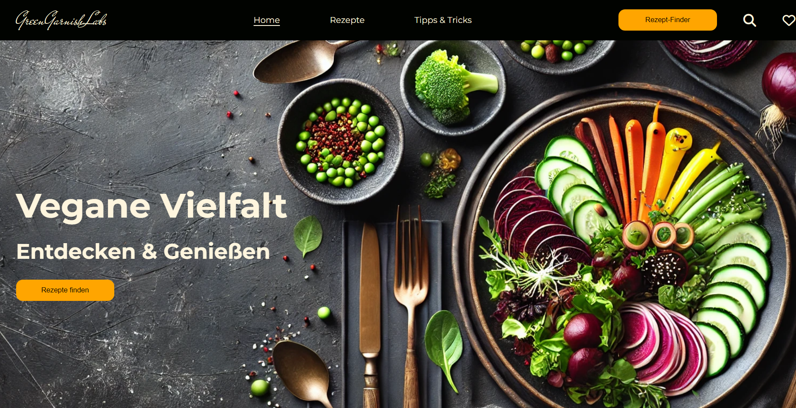
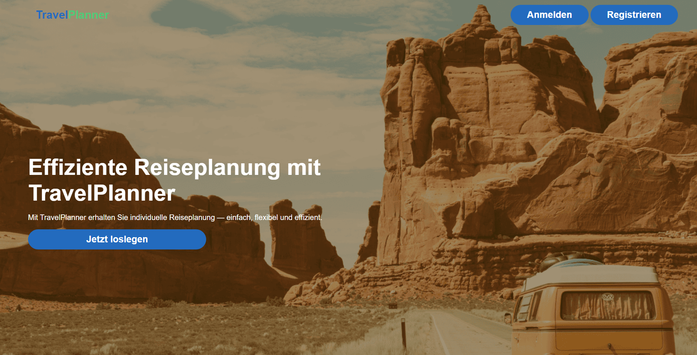

# 👋 Hey, I'm Levin!

I'm a **Web Design and Development student** at **SAE Zürich**, where I spend my days turning ideas into stunning, interactive websites. Whether it's a sleek UI or smooth functionality, I'm all about crafting experiences that users love to interact with. When I'm not coding, you'll find me experimenting with new design trends or brainstorming my next project. 🌱✨

---

### 🚀 **What I'm working on**  
- **[GreenGarnishLabs](https://github.com/Vogel1638/greengarnishlabs)** – A **recipe collection** for healthy, plant-based meals. Think vegan, vegetarian, and everything in between.

- **[TravelPlanner](https://github.com/Vogel1638/travelplanner)** – Your **ultimate travel planner** to make your next adventure smooth and unforgettable.

---

### 📫 **Let's connect!**  
- 📧 **Email**: [levvogt@gmail.com](mailto:levvogt@gmail.com)  
- 🔗 **LinkedIn**: [Check out my LinkedIn](https://www.linkedin.com/in/levin-vogt-134306287)

---
